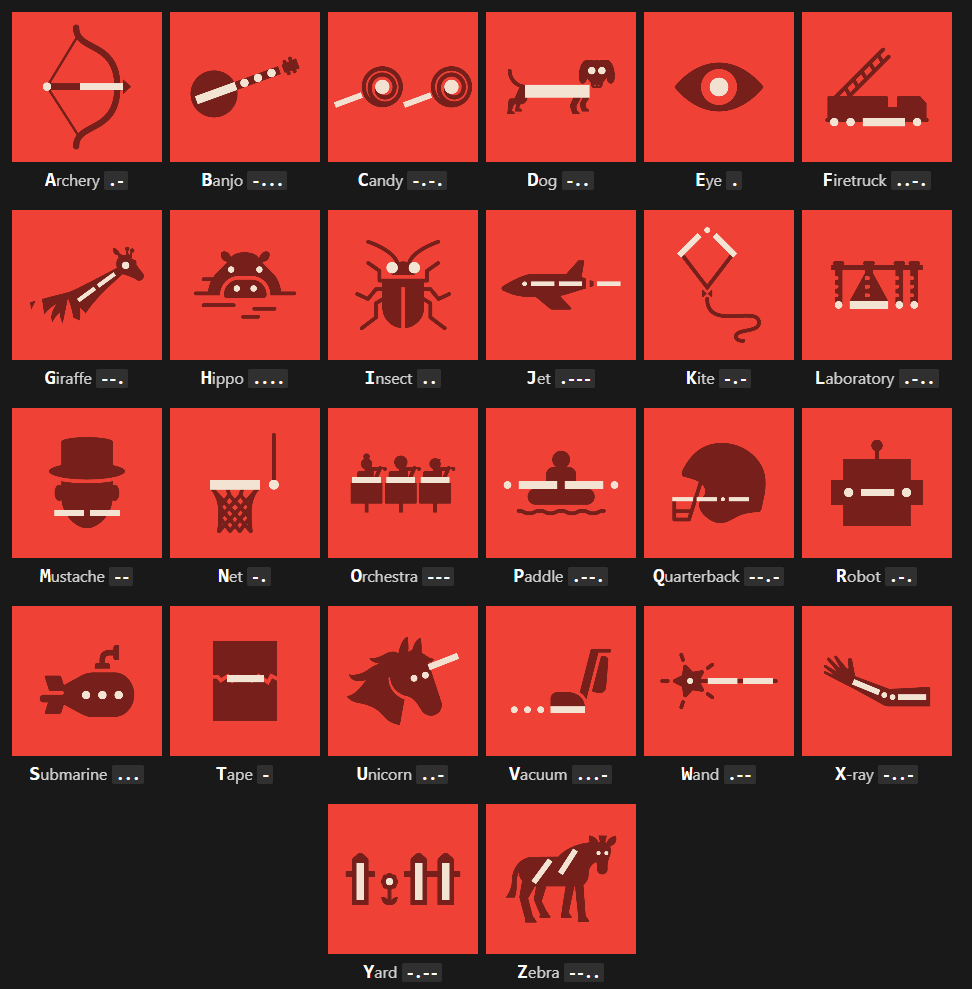

# Z MORSE

[ zmorse.vercel.app](https://zmorse.vercel.app)


[](https://github.com/zsphinxyz/zmorse/actions/workflows/nextjs.yml)


## Packages
  - Next.js
  - TypeScript
  - Zustand
  - Framer Motion

## Getting Started
```
pnpm install
pnpm run dev
```


Sprite images are from https://morse.withgoogle.com/learn/